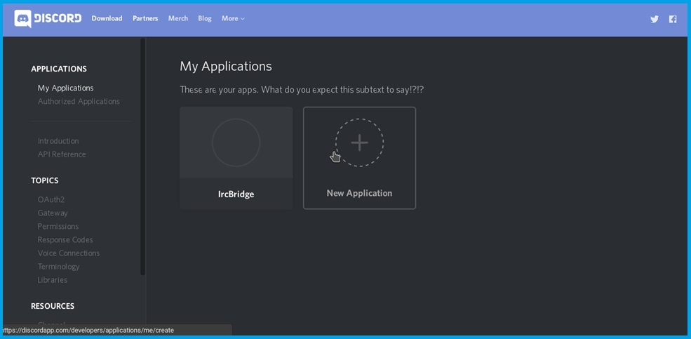
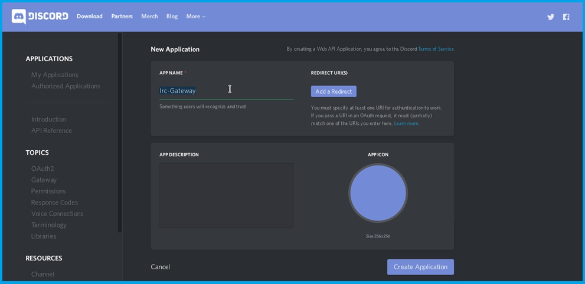
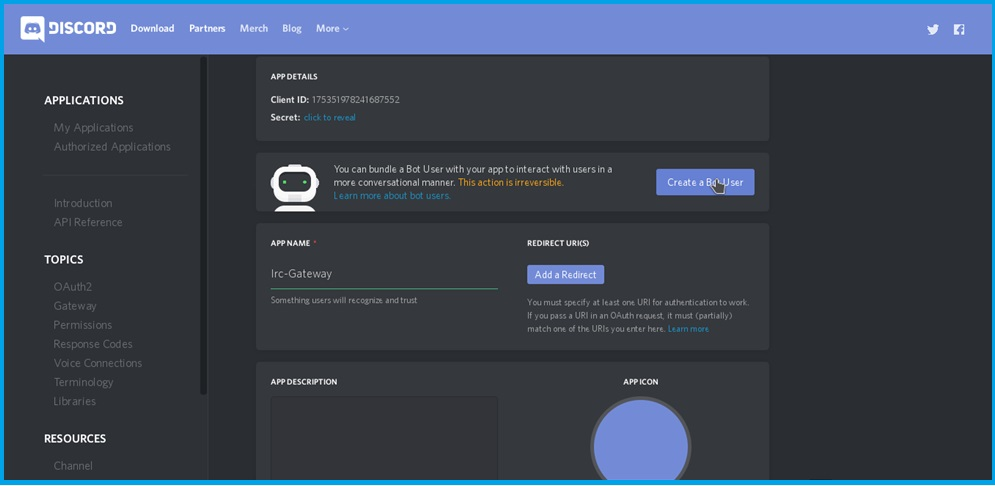
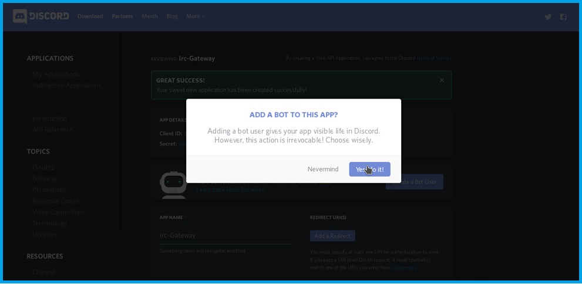
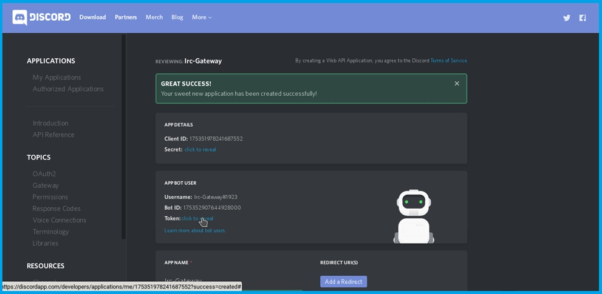
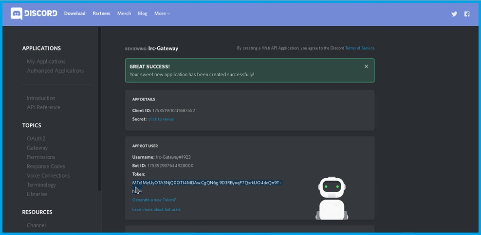

[](https://matrix.to/#/#mx-puppet-bridge:sorunome.de) [](https://liberapay.com/Sorunome/donate)

# mx-puppet-discord
This is a discord puppeting bridge for matrix. It handles bridging private and group DMs, as well as Guilds (servers).
It is based on [mx-puppet-bridge](https://github.com/Sorunome/mx-puppet-bridge).

Also see [matrix-appservice-discord](https://github.com/Half-Shot/matrix-appservice-discord) for an alternative guild-only bridge.

## Setup

Clone the repo and install the dependencies:

```
git clone https://github.com/matrix-discord/mx-puppet-discord
cd mx-puppet-discord
npm install
```

Copy and edit the configuration file to your liking:

```
cp sample.config.yaml config.yaml
... edit config.yaml ...
```

Generate an appservice registration file. Optional parameters are shown in
brackets with default values:

```
npm run start -- -r [-c config.yaml] [-f discord-registration.yaml]
```

Then add the path to the registration file to your synapse `homeserver.yaml`
under `app_service_config_files`, and restart synapse.

Finally, run the bridge:

```
npm run start
```

## Usage

Start a chat with `@_discordpuppet_bot:yourserver.com`. When it joins, type
`help` in the chat to see instructions.

### Linking a Discord bot account

This is the recommended method, and allows Discord users to PM you through a
bot.

First visit your [Discord Application
Portal](https://discordapp.com/login?redirect_to=%2Fdevelopers%2Fapplications%2Fme).

1. Click on 'New Application'



2. Customize your bot how you like



3. Go to ‘**Create Application**’ and scroll down to the next page. Find ‘**Create a Bot User**’ and click on it.



4. Click '**Yes, do it!**



5. Find the bot's token in the '**App Bot User**' section.



6. Click '**Click to Reveal**'



Finally, send the appservice bot a message with the contents `link bot
your.token-here`.

### Linking your Discord account

**Warning**: Linking your user account's token is against Discord's Terms of Service.

First [retrieve your Discord User Token](https://discordhelp.net/discord-token).

Then send the bot a message with the contents `link user your.token-here`.

### Guild management

As most users are in many guilds none are bridged by default. You can, however, enable bridging a guild. For that use `listguilds <puppetId>`, e.g. `listguilds 1`. (Puppet ID can be found with `list`.)

Then, to bridge a guild, type `bridgeguild <puppetId> <guildId>` and to unbridge it type `unbridgeguild <puppetId> <guildId>`

### Friends management

**IMPORTANT! This is a USER-token ONLY feature, and as such against discords TOS. When developing this test-accounts got softlocked, USE AT YOUR OWN RISK!**

You first need to enable friends management with `enablefriendsmanagement <puppetId>`.

You can view all friends and invitation status with `listfriends <puppetId>`.

You can accept a friends request / send a friends request with `addfriend <puppetId> <user>` where `<user>` is either the user ID (preferred) or the `username#1234`.

You can remove friends with `removefriend <puppetId> <userId>`.

## Docker

Build docker image:

    docker build -t mx-puppet-discord .

You may want some changes in your config.yaml:

```yaml
bindAddress: 0.0.0.0
filename: '/data/database.db'
file: '/data/bridge.log'
```

Once the bridge has generated the `discord-registration.yaml` edit it to fix the
address so that your matrix home server can connect to the bridge:

```yaml
url: 'http://discord:8434'
```
